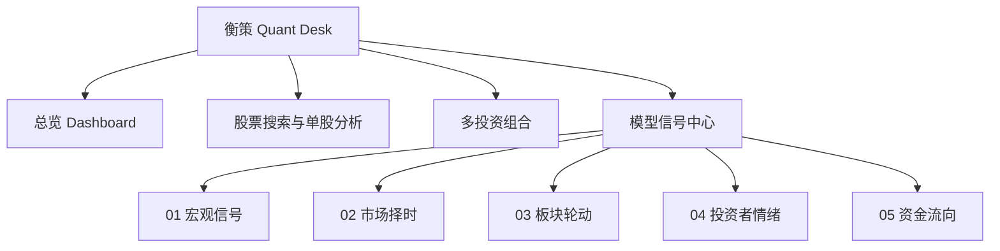

# 衡策 Quant Desk：完整 UI 与产品说明

> 产品类型：中美股票量化研究与投资组合观察平台  
> 当前版本：0.1.0  
> 整理日期：2026-08-14  
> 当前形态：本地运行的现代 SaaS Dashboard 原型

## 1. 产品概述

衡策 Quant Desk 面向同时关注中国 A 股和美国股票的个人研究者。产品把股票搜索、单股技术分析、多投资组合观察，以及宏观、择时、板块、情绪和资金流五组模型信号集中在一个工作台中。

当前产品重点不是自动下单，而是帮助使用者完成以下工作：

1. 快速搜索 A 股或美股并查看分析结果。
2. 自主决定是否把股票加入某个观察组合。
3. 创建多个持仓 List，对比不同投资思路。
4. 分别观察中国和美国市场所处的宏观与市场阶段。
5. 把原始数据转化为可以解释和追溯的模型证据。

## 2. 信息架构



主要页面路由：

| 页面 | 本地路由 |
| --- | --- |
| 总览 | `#overview` |
| 模型信号目录 | `#signals` |
| 宏观信号 | `#signals/macro` |
| 市场择时 | `#signals/market-timing` |
| 板块轮动 | `#signals/sector-rotation` |
| 投资者情绪 | `#signals/investor-sentiment` |
| 资金流向 | `#signals/capital-flow` |

## 3. 整体视觉设计

UI 采用现代、简洁、低干扰的 SaaS Dashboard 设计：

- 左侧导航承担页面切换、模型目录和投资组合切换。
- 顶部区域展示当前上下文、市场状态、全局股票搜索和深浅色切换。
- 主内容区使用卡片、低饱和度颜色、细边框和紧凑的数据层级。
- 中国市场使用暖红棕色作为识别色，美国市场使用蓝色作为识别色。
- 绿色表示改善或正向证据，红色表示恶化或风险，黄色表示警告。
- 桌面端与移动端均采用响应式布局，并避免横向溢出。
- 图表支持鼠标、触控和键盘操作。

## 4. 总览 Dashboard

总览是整个软件的 Desktop，而不是单一分析页面。它负责把投资组合、资产配置和五类模型信号的入口集中展示。

### 4.1 组合核心指标

当前总览可以展示：

- 组合总市值
- 当日变化
- 建仓以来累计收益率
- 累计收益金额
- A 股、美股和现金配置比例
- 单只持仓的价格、市值、权重与涨跌

### 4.2 数据真实性说明

当前默认的组合名称、现金、持仓数量、成本价、美元兑人民币汇率和初始股票价格属于 UI 演示数据。它们用于验证组合计算和界面结构，不代表任何真实账户。

因此，页面中类似“组合总市值、累计收益”的数字来自当前内存中的演示持仓计算，不应对外描述为真实账户收益。

当前美元资产折算暂时使用固定汇率 `1 USD = 7.18 CNY`。正式版本需要接入实时外汇数据。

## 5. 股票搜索与单股分析

### 5.1 搜索范围

搜索同时支持：

- 中国 A 股六位股票代码，例如 `000410`。
- A 股公司名称。
- 美国股票代码，例如 `AAPL`、`MSFT`、`NVDA`。
- 美国公司名称。

A 股代码会按照交易所规则转换为正确的数据源代码，例如 `000410` 会被识别为深圳股票，而不是因为缺少后缀而查询失败。

### 5.2 搜索与持仓解耦

搜索结果默认用于查看股票分析，不会自动加入当前持仓。

每条结果提供两个独立操作：

1. 点击股票主体，打开单股分析。
2. 点击旁边的添加按钮，才会加入当前选择的投资组合。

如果股票已经在当前组合中，分析功能仍然可用，但添加按钮会显示为已添加，防止重复加入。

### 5.3 单股分析内容

单股分析弹窗目前包含：

- 最新价格
- 当日涨跌
- 趋势状态与文字解释
- 20 日、50 日和 200 日均线
- RSI（14 日）
- 区间技术状态
- 数据来源与更新时间

单股技术分析使用真实日线行情计算，不使用预写的趋势结论。

## 6. 多投资组合功能

使用者可以创建多个独立的持仓 List，用于观察不同投资思路，例如：

- 核心长期组合
- AI 成长实验
- 防守配置
- 自定义主题或策略组合

每个组合拥有自己的：

- 名称和说明
- 现金余额
- 股票列表
- 持仓数量与成本
- 市值和收益计算
- A 股、美股与现金配置比例

股票可以加入当前选择的组合，也可以从组合中移除。

### 当前限制

组合数据目前保存在浏览器运行内存中，刷新页面后新增组合和持仓不会永久保存。下一阶段需要接入 LocalStorage、本地数据库或用户账户后端。

## 7. 模型信号中心

模型信号由五个相互独立但可以在未来综合的分析层组成：

| 编号 | 模块 | 主要问题 |
| --- | --- | --- |
| 01 | 宏观信号 | 当前经济和流动性环境处于什么阶段？ |
| 02 | 市场择时 | 当前是否适合增加、维持或降低市场风险？ |
| 03 | 板块轮动 | 哪些板块正在领先、修复、过热或落后？ |
| 04 | 投资者情绪 | 市场处于恐慌、修复、健康还是拥挤阶段？ |
| 05 | 资金流向 | 资金压力正在流入还是流出哪些板块？ |

五个页面都把中国股票与美国股票分开计算和展示。

## 8. 统一时间范围

所有模型信号页面统一使用以下时间选项：

- 1日
- 1周
- 1月
- 3月
- 1年
- 自定义起点

选择时间后，系统使用“所选起点之后的第一个有效观察值”与“最新有效数据”进行比较。周末、节假日和非交易日不会被错误地当作零值。

对应页面中的趋势、变化程度、模型证据和阶段结果会随时间范围重新计算，而不是只改变按钮状态。

## 9. 宏观信号

宏观信号分别建立中国宏观环境和美国宏观环境。

### 9.1 中国指标

| 组别 | 指标 |
| --- | --- |
| 货币与信用 | M1 同比、M2 同比 |
| 增长周期 | 制造业 PMI、规模以上工业增加值同比 |
| 通胀与盈利 | CPI 同比、PPI 同比、PPI－CPI 剪刀差 |

### 9.2 美国指标

| 组别 | 指标 |
| --- | --- |
| 通胀与美联储 | 核心 CPI 同比、CPI 同比、联邦基金有效利率 |
| 增长与就业 | 非农就业月增量、失业率 |
| 金融条件 | 美国 10 年期实际利率、10 年－2 年期限利差 |

### 9.3 页面能力

- 当前值、上期变化和阶段标签。
- 每项指标的历史走势图。
- 鼠标悬停显示具体年月和数值。
- 参考线、区间高低点和起点变化。
- 宏观阶段、主要驱动因素和策略倾向。
- 原始数据来源链接与数据更新时间。

主要免费数据来源包括东方财富数据中心、美国劳工统计局 BLS Public Data API 和美联储 H.15。

## 10. 市场择时

市场择时分别计算中国股票和美国股票的风险环境。

### 五维证据

1. 趋势
2. 市场广度
3. 成交与流动性
4. 波动与压力
5. 风险偏好

五维证据总权重为 100%，并随所选时间范围重新计算。页面展示市场综合分数、风险状态、基准走势和每一维的变化依据。

中国市场主要使用 BaoStock，数据不可用时可以使用新浪公开行情作为备用源；美国市场使用 Yahoo Finance / yfinance。用户无需配置 API Key。

每次进入“市场择时”页面都会检查数据状态，后台缓存用于减少重复等待。

## 11. 板块轮动

板块轮动分别维护中国和美国的 11 个标准行业板块：

- 能源
- 原材料
- 工业
- 可选消费
- 主要消费
- 医疗保健
- 金融
- 信息技术
- 通信服务
- 公用事业
- 房地产

### 六维板块评分

| 维度 | 权重 | 作用 |
| --- | ---: | --- |
| 相对动量 | 30% | 对比基准的 5/20/60/120 日表现 |
| 趋势质量 | 25% | 均线排列、斜率和价格位置 |
| 市场宽度 | 15% | 上涨参与面与趋势一致性代理 |
| 资金确认 | 15% | 价格位置、方向和量能确认 |
| 风险效率 | 10% | 收益、波动和回撤的性价比 |
| 宏观适配 | 5% | 当前为中性占位，后续连接宏观模型 |

页面提供：

- 中美独立板块排名。
- 轮动象限与阶段分类。
- 领先、过热、修复和落后状态。
- 板块详情走势图。
- 风险预算和组合约束提示。
- 点击板块后查看对应证据。

中国板块使用 BaoStock 行业指数和部分 ETF 代理，美国板块使用标准 SPDR 行业 ETF。

## 12. 投资者情绪

投资者情绪使用“情绪水平 Level + 情绪动量 Impulse”的双轴方法。

### 四维证据

| 维度 | 权重 |
| --- | ---: |
| 恐慌与避险 | 25% |
| 市场参与度 | 30% |
| 仓位与风险偏好 | 25% |
| 投机与拥挤 | 20% |

综合分数范围为 0–100：

- 0–25：恐慌区
- 25–75：平衡区
- 75–100：贪婪区

模型结合水平和动量识别恐慌恶化、恐慌企稳、情绪修复、谨慎降温、健康风险偏好、狂热加速或拥挤退潮等阶段。

原 UI 中的“地量衰竭”和“放量拥挤”已经保留为可审计子信号，但不再单独决定仓位。

## 13. 资金流向

资金流向延续原开源项目 `sector-flow` 的核心思路，同时与板块轮动保持数据关联、页面分离。

### 13.1 九项证据

1. 价格变化
2. CMF
3. 估算净流额
4. Flow %
5. 涨跌量比
6. RVOL
7. 收盘位置
8. MFI
9. OBV 变化

上述指标分别计算 1 日、5 日和 20 日窗口，用于判断流入、流出、持续性和价量背离。

### 13.2 与板块轮动的融合方式

- 数据层融合：两者复用相同的板块行情和缓存，避免重复访问免费数据源。
- 模型层关联：板块轮动中的“资金确认”引用去重后的资金证据。
- 页面层分离：板块轮动回答“哪个板块更强”，资金流向回答“资金是否真正到来”。
- 结果层交叉验证：趋势领先但资金未确认时标记观察；趋势与资金同时改善时提高可信度。

### 13.3 板块与成分股

每个板块都可以点击展开，查看该板块包含的代表股票以及股票级资金证据。

美股成分池继承原 `sector-flow` 的设计；A 股当前使用透明的高流动性代表股研究池，不冒充交易所实时官方权重。

### 重要口径

当前“资金流”主要根据公开日线价格位置和成交量推算方向性资金压力，不代表交易所披露的机构真实净买入，也不应与 Level-2 主力资金数据混为一谈。

## 14. 数据接口与性能设计

### 14.1 当前数据源

| 数据类别 | 免费来源 |
| --- | --- |
| A 股搜索与行情 | BaoStock、Yahoo Finance 补充 |
| 美股搜索与行情 | Yahoo Finance / yfinance |
| 中国宏观 | 东方财富数据中心，原始口径来自国家统计局或人民银行 |
| 美国宏观 | BLS Public Data API、美联储 H.15 |
| 中美市场择时 | BaoStock、Yahoo Finance / yfinance |
| 中美板块与资金证据 | BaoStock、行业 ETF、Yahoo Finance / yfinance |

### 14.2 共享缓存与后台预载

系统按照数据来源对请求进行分组：

- 相同数据源的一组标的一次批量获取。
- 市场择时、板块轮动、投资者情绪和资金流向共享行情缓存。
- 资金流向直接复用板块轮动数据，不再单独重复抓取。
- 进入应用后在后台预载主要信号页面。
- 页面切换优先使用内存缓存，再按刷新周期检查新数据。
- 上游暂时失败时可以使用最近一次成功缓存，并明确标记状态。

这套结构用于减少“每打开一个页面都重新等待接口”的卡顿感。

## 15. 图表交互与可访问性

宏观、市场择时、板块轮动、投资者情绪和资金流向图表均提供具体日期交互。

- 鼠标移动到图表位置时显示日期和点位。
- 触控设备可以检查对应数据点。
- 图表可通过 Tab 键聚焦。
- 左右方向键逐点移动。
- Home 跳到起点，End 跳到最新数据。
- 错误状态不会展示伪造的示例数值。
- 关键按钮具有可辨识的文字或无障碍标签。

## 16. 当前已完成状态

| 功能 | 状态 |
| --- | --- |
| 现代 SaaS Dashboard 布局 | 已完成 |
| 中美股票搜索 | 已完成 |
| `000410` 等 A 股代码识别 | 已完成 |
| 搜索、分析与添加持仓解耦 | 已完成 |
| 单股技术分析 | 已完成 |
| 创建多个投资组合 | 已完成，暂未持久化 |
| 宏观信号中美分离 | 已完成 |
| 市场择时中美分离 | 已完成 |
| 板块轮动中美分离 | 已完成 |
| 投资者情绪中美分离 | 已完成 |
| 资金流向与成分股展开 | 已完成 |
| 六种统一时间范围 | 已完成 |
| 图表具体日期交互 | 已完成 |
| 数据批量预载与共享缓存 | 已完成 |
| 最终五模型综合信号 | 尚未完成 |
| 真实账户或券商连接 | 尚未完成 |
| 用户登录与云端组合保存 | 尚未完成 |
| 自动交易与订单执行 | 不在当前版本范围 |

## 17. 测试与验证

截至 2026-08-14：

- 49 个 Python 后端测试通过。
- 36 个 JavaScript 前端测试通过。
- Vite 生产构建通过。
- 中美投资者情绪真实接口验证为 `live`。
- 统一时间范围可以改变模型比较结果。
- 桌面和窄屏布局无横向溢出。
- 实际浏览器测试没有发现控制台警告或错误。

测试通过代表当前代码契约和主要交互符合预期，不代表模型已经完成长期样本外收益验证。

## 18. 下一阶段建议

建议按照以下顺序继续：

1. 完成五类模型信号的综合评分和最终策略解释。
2. 明确各模型间的去重规则，避免趋势、价格和成交量被多次计算。
3. 为组合加入持久化存储和持仓数量、成本、现金的编辑能力。
4. 接入实时汇率，替换固定美元折算。
5. 建立历史回测模块，验证信号对未来收益、波动和最大回撤的解释能力。
6. 为可选高级数据设计插件接口，同时保留免费零配置基础版本。
7. 增加正式部署、用户登录、隐私和数据许可说明。

## 19. 本地运行方式

在项目目录中分别启动后端和前端：

```bash
npm install
npm run dev:api
npm run dev
```

然后访问：

```text
http://127.0.0.1:5173/
```

## 20. 风险与免责声明

本产品仍处于研究与 UI 原型阶段。所有模型输出均为公开数据和代理变量的计算结果，不构成投资建议、收益承诺或自动交易指令。

免费数据源的授权、字段和可用性可能变化；任何正式公开发布都应再次核对数据许可。使用者在做出实际投资决策前，应独立核验数据，并结合估值、基本面、风险预算和个人承受能力。

